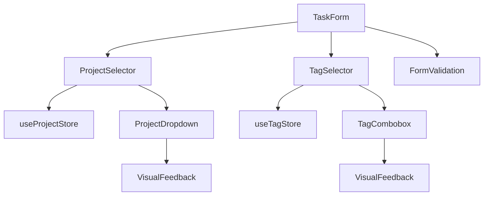

# Design Document

## Overview

本設計では、[全てのタスク]画面における「新しいタスク」作成機能でのプロジェクトとタグ選択に関する重要なバグを修正します。現在、プロジェクトを選択してもボタンに反映されず、タグセレクターをクリックしてもドロップダウンが表示されない問題が発生しています。この修正では、既存のProjectSelectorとTagSelectorコンポーネントの状態管理とUIフィードバック機能を改善し、ユーザーが直感的にタスクの分類を行えるようにします。

## Steering Document Alignment

### Technical Standards (tech.md)
- TypeScript による厳密な型安全性の維持
- React Hooks パターンの継続使用
- 既存のコンポーネント設計パターンとの整合性
- Zustand状態管理パターンの活用

### Project Structure (structure.md)
- src/components/project/ 配下でのProjectSelector改善
- src/components/tag/ 配下でのTagSelector修正
- 既存のフォルダ構造の維持と一貫性確保

## Code Reuse Analysis

### Existing Components to Leverage
- **ProjectSelector**: 既存のドロップダウン機能とプロジェクト選択ロジックを維持し、視覚的フィードバック機能を強化
- **TagSelector**: 基本的なcombobox構造を保持し、ドロップダウン表示機能を修正
- **TaskForm**: 親コンポーネントとして、selector componentsとの統合を継続
- **Button, Combobox UI コンポーネント**: 既存のスタイリングとアクセシビリティ機能を活用

### Integration Points
- **useProjectStore**: プロジェクトデータ取得と選択状態管理の既存パターンを維持
- **useTagStore**: タグデータアクセスとタグ作成機能との統合継続
- **TaskForm状態管理**: formDataとselectorコンポーネント間のデータフロー改善
- **バリデーションシステム**: 既存のvalidationUtilsとの互換性維持

## Architecture

この修正では、既存のコンポーネントアーキテクチャを維持しながら、状態管理の一貫性と視覚的フィードバックの改善に焦点を当てます。制御されたコンポーネントパターンを強化し、プロップスとコールバック間の明確なデータフローを確立します。

### Modular Design Principles
- **Single Component Responsibility**: ProjectSelectorはプロジェクト選択のみ、TagSelectorはタグ管理のみに責任を限定
- **State Management Separation**: 各コンポーネントの内部状態と親フォームの状態管理を明確に分離
- **UI Feedback Isolation**: 視覚的フィードバック機能を独立したユーティリティ関数として実装
- **Error Boundary Containment**: エラー処理を各セレクターコンポーネント内で完結



## Components and Interfaces

### Enhanced ProjectSelector Component
- **Purpose:** プロジェクト選択機能の提供と選択状態の視覚的フィードバック改善
- **Interfaces:** 
  - `onProjectSelect(project: Project | null)`: 既存のプロジェクト選択コールバック
  - `selectedProject?: Project`: 選択されたプロジェクトの明示的表示状態
  - Enhanced visual feedback for selection state
- **Dependencies:** useProjectStore, Button UI component, dropdown state management
- **Reuses:** 既存のプロジェクトリスト取得機能、ドロップダウン開閉ロジック

### Enhanced TagSelector Component  
- **Purpose:** タグ選択・作成機能とドロップダウン表示の修正
- **Interfaces:**
  - `onTagsChange(tags: Tag[])`: 既存のタグ変更コールバック
  - `selectedTags: Tag[]`: 選択済みタグの配列
  - Enhanced dropdown visibility and interaction
- **Dependencies:** useTagStore, Combobox UI component, tag creation utilities
- **Reuses:** 既存のタグフィルタリング機能、タグ作成ロジック

### Visual Feedback Utilities
- **Purpose:** セレクターコンポーネントの一貫した視覚的フィードバック提供
- **Interfaces:**
  - `updateButtonDisplay(selectedItem: any, placeholder: string): string`
  - `showSelectionState(isSelected: boolean, isOpen: boolean): CSSClasses`
- **Dependencies:** CSS utility functions, theme system
- **Reuses:** 既存のスタイリングパターン、アクセシビリティ属性

### Form Integration Layer
- **Purpose:** TaskFormと各セレクターコンポーネント間のデータフロー管理
- **Interfaces:**
  - `handleProjectChange(project: Project | null)`: プロジェクト選択の統合処理
  - `handleTagsChange(tags: Tag[])`: タグ選択の統合処理
- **Dependencies:** TaskForm, validation utilities
- **Reuses:** 既存のフォーム状態管理パターン

## Data Models

### Enhanced ProjectSelectorState
```typescript
interface ProjectSelectorState {
  selectedProject: Project | null;
  isDropdownOpen: boolean;
  isLoading: boolean;
  displayText: string; // 新規: ボタン表示用テキスト
  hasSelection: boolean; // 新規: 選択状態フラグ
}
```

### Enhanced TagSelectorState
```typescript
interface TagSelectorState {
  selectedTags: Tag[];
  availableTags: Tag[];
  isDropdownVisible: boolean; // 修正: 表示状態の明示的管理
  inputValue: string;
  isCreating: boolean;
  filteredTags: Tag[];
}
```

### Enhanced VisualFeedback
```typescript
interface VisualFeedback {
  displayState: 'default' | 'selected' | 'open' | 'error';
  buttonText: string;
  iconState: 'closed' | 'open' | 'loading';
  accessibilityAttributes: Record<string, string>;
}
```

## Error Handling

### Error Scenarios
1. **プロジェクト選択後の表示更新失敗**
   - **Handling:** 選択状態をローカルストレージにバックアップし、コンポーネント再マウント時に復元
   - **User Impact:** 選択したプロジェクトが一時的に表示されない場合でも、フォーム送信時には正しく処理
   - **Recovery:** 自動リトライ機能と手動リフレッシュオプションの提供

2. **タグセレクターのドロップダウン表示失敗**
   - **Handling:** CSS visibility状態とJavaScript状態の同期チェック機能を実装
   - **User Impact:** ドロップダウンが見えない場合は、明示的なエラーメッセージとキーボードナビゲーション案内を表示
   - **Recovery:** フォールバックとしてシンプルなテキスト入力モードを提供

3. **プロジェクト/タグデータ読み込み失敗**
   - **Handling:** ローカルキャッシュからの復元とオフラインモード対応
   - **User Impact:** データ取得中はローディング表示、失敗時は再試行ボタンを表示
   - **Recovery:** ネットワーク復旧時の自動再同期機能

4. **フォーム送信時の選択データ不整合**
   - **Handling:** 送信前の選択状態検証と自動修正機能
   - **User Impact:** 送信エラー時は具体的な修正点を表示
   - **Recovery:** ワンクリックでの選択状態リセットオプション

## Testing Strategy

### Unit Testing
- **ProjectSelector**: 選択状態の表示更新ロジック、ドロップダウン開閉動作、コールバック呼び出しテスト
- **TagSelector**: ドロップダウン表示制御、タグフィルタリング、新規タグ作成機能テスト
- **Visual Feedback Utilities**: 各種状態での表示テキスト生成、CSSクラス適用ロジックテスト

### Integration Testing
- **TaskForm Integration**: プロジェクト選択からフォーム状態更新までの完全フロー
- **Store Integration**: プロジェクト・タグストアとの双方向データフロー検証
- **Validation Integration**: 選択された項目のバリデーション実行と結果反映

### End-to-End Testing
- **Complete Task Creation Flow**: プロジェクト選択 → タグ設定 → フォーム送信 → タスク作成完了
- **Error Recovery Scenarios**: ネットワークエラー、データ不整合、UI状態異常からの復旧
- **Cross-browser Visual Testing**: 各ブラウザでのドロップダウン表示、視覚的フィードバックの一貫性
- **Accessibility Testing**: キーボードナビゲーション、スクリーンリーダー対応、カラーコントラスト検証