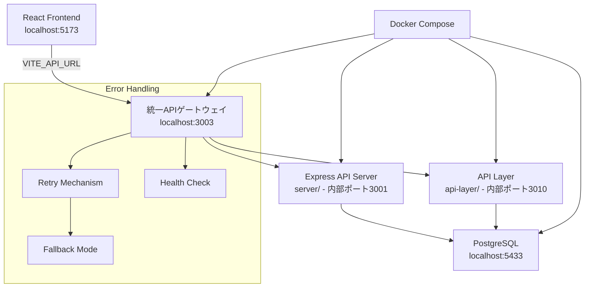

# Design Document: API接続拒否エラー修正

## Overview
本設計は、タスク作成時に発生する`net::ERR_CONNECTION_REFUSED`エラーを解決し、フロントエンドとバックエンドAPIの確実な接続を確保するためのものです。現在の問題は、フロントエンドが設定されたAPIエンドポイント（ポート3003）に接続できないことにあります。

## Code Reuse Analysis

### Existing Components to Leverage
- **SimpleApiClient (taskApi.ts)**: 基本的なAPI通信機能は再利用可能。リトライ機構と接続状態監視機能を拡張
- **Docker Compose設定**: 既存のマルチコンテナ環境を活用。APIサービスの起動設定を統一
- **環境変数システム**: 既存の`.env`ファイル構造を利用してポート設定を統一

### Integration Points
- **TaskStore**: 既存のMobX store pattern、API失敗時のフォールバック機構を活用
- **Database (PostgreSQL)**: 既存のPrismaクライアント、データベース接続設定は変更せず
- **React Error Boundary**: 既存のエラーハンドリング機構を拡張

## Architecture

プロジェクト内に現在存在する複数のAPIサーバー（`server/`ポート3001、`api-layer/`ポート3010）と、フロントエンドが期待するポート（3003）の不整合を解決する統合アーキテクチャを設計します。

### Modular Design Principles
- **Single API Endpoint**: 単一のAPIエンドポイントに統一し、複数サーバーの混在を解消
- **Connection Resilience**: 接続失敗に対する段階的な復旧機構
- **Configuration Centralization**: 環境変数による一元的なポート・URL管理
- **Service Health Monitoring**: Docker Composeレベルでのヘルスチェック統一



## Components and Interfaces

### Component 1: API Gateway Service
- **Purpose:** フロントエンドの単一エンドポイントとして機能し、内部APIサーバーへリクエストをルーティング
- **Interfaces:** 
  - `POST /api/v1/tasks` - タスク作成API
  - `GET /health` - ヘルスチェックエンドポイント
  - `GET /api/v1/tasks` - タスク一覧取得
- **Dependencies:** 内部APIサーバー（server/, api-layer/）
- **Reuses:** Express基盤、CORSミドルウェア、既存のルーティングパターン

### Component 2: Enhanced API Client (Frontend)
- **Purpose:** 接続障害に対する堅牢性を提供するAPIクライアント
- **Interfaces:** 
  - `createTaskWithRetry(task: CreateTaskInput): Promise<Task>`
  - `checkApiHealth(): Promise<boolean>`
  - `enableOfflineMode(): void`
- **Dependencies:** fetch API, 既存のSimpleApiClient
- **Reuses:** 現在のtaskApiクライアント、エラーハンドリング機構

### Component 3: Docker Service Configuration
- **Purpose:** 統一されたAPIサービスの起動と管理
- **Interfaces:** Docker Composeサービス定義、ヘルスチェック、環境変数
- **Dependencies:** PostgreSQL、既存のappサービス
- **Reuses:** 既存のネットワーク設定、ボリューム構成

### Component 4: Connection State Management
- **Purpose:** API接続状態の監視とユーザーへの状態通知
- **Interfaces:** 
  - `ConnectionStatus: 'connected' | 'reconnecting' | 'offline'`
  - `onConnectionChange(callback: (status) => void)`
- **Dependencies:** React Context、既存のTaskStore
- **Reuses:** MobX observable pattern

## Data Models

### ConnectionState Model
```typescript
interface ConnectionState {
  status: 'connected' | 'reconnecting' | 'offline';
  lastError?: Error;
  retryCount: number;
  lastSuccessTime?: Date;
}
```

### RetryConfiguration Model
```typescript
interface RetryConfig {
  maxRetries: 3;
  retryDelays: [1000, 2000, 4000]; // ms
  timeoutMs: 5000;
}
```

### ApiEndpoint Model
```typescript
interface ApiEndpoint {
  baseUrl: string;
  port: number;
  healthPath: string;
  timeout: number;
}
```

## Error Handling

### Error Scenarios
1. **API Server Not Started**
   - **Handling:** Docker Compose自動起動、ヘルスチェック待機
   - **User Impact:** 「APIサーバーを起動中...」メッセージ、進行状況表示

2. **Network Connection Failure**  
   - **Handling:** 指数バックオフによるリトライ（1秒→2秒→4秒）
   - **User Impact:** 「接続を再試行中...」、リトライ回数表示

3. **Port Configuration Mismatch**
   - **Handling:** 環境変数検証、設定不整合の自動検出
   - **User Impact:** 明確なエラーメッセージとトラブルシューティングガイド

4. **Database Connection Issues**
   - **Handling:** データベースヘルスチェック、接続プール管理
   - **User Impact:** 「データベース接続中...」、データ同期状態の表示

## Testing Strategy

### Unit Testing
- APIクライアントのリトライ機構テスト
- 接続状態管理ロジックのテスト
- エラーハンドリング関数の境界値テスト

### Integration Testing
- フロントエンド-APIゲートウェイ間通信テスト
- Docker Compose環境での統合テスト
- データベース接続とタスクCRUD操作テスト

### End-to-End Testing
- タスク作成フローの完全テスト（正常系・異常系）
- API障害時の復旧フローテスト
- 複数ブラウザ環境でのクロステスト

## Implementation Plan

### Phase 1: Infrastructure Fix
1. Docker Compose設定の統一とAPIゲートウェイサービス追加
2. 環境変数の整理と統一（ポート3003使用）
3. ヘルスチェック機構の実装

### Phase 2: Client Enhancement  
1. リトライ機構付きAPIクライアントの実装
2. 接続状態管理コンポーネントの追加
3. ユーザー向けエラー表示の改善

### Phase 3: Testing & Validation
1. 統合テストの実行と検証
2. エラーシナリオの網羅的テスト
3. パフォーマンス検証とチューニング

## Performance Considerations
- API応答時間目標: 200ms以内（95パーセンタイル）
- リトライ処理が他の操作をブロックしない非同期実装
- 接続状態キャッシュによる不要な重複チェック回避