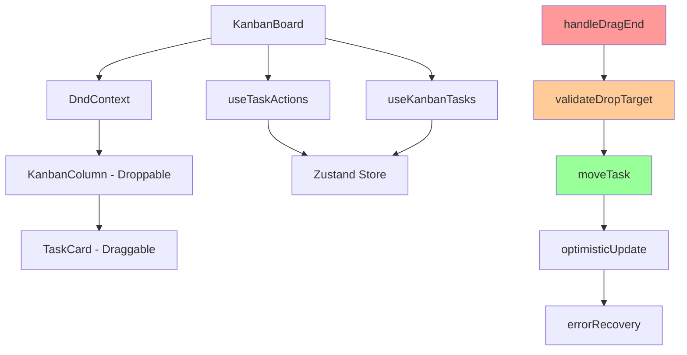

# Design Document

## Overview

This design addresses the critical drag-and-drop bug in the kanban board where tasks fail to move between columns despite UI interaction being recognized. The issue lies in improper droppable area matching and inconsistent state updates. The solution implements improved drag-drop validation, optimistic UI updates, and robust error handling while maintaining the existing dnd-kit architecture.

## Steering Document Alignment

### Technical Standards (tech.md)
Following the established React + TypeScript patterns with dnd-kit library integration. Maintaining the component architecture with single responsibility principle and proper error boundaries.

### Project Structure (structure.md)
Working within the existing `/src/components/kanban/` structure with minimal impact on other components. Preserving the separation between presentation and business logic layers.

## Code Reuse Analysis

### Existing Components to Leverage
- **KanbanBoard.tsx**: Main drag-drop logic container - requires bug fixes in handleDragEnd
- **KanbanColumn.tsx**: Drop zone implementation - needs improved droppable area validation
- **TaskCard.tsx**: Draggable items - maintain existing drag preview functionality
- **useTaskActions hook**: State management - enhance moveTask function with better error handling
- **useKanbanTasks hook**: Data fetching - maintain existing task retrieval patterns

### Integration Points
- **Zustand Task Store**: Existing state management will handle task status updates
- **dnd-kit Library**: Continue using established drag-drop framework with improved event handling
- **Task Type System**: Leverage existing TaskStatus enum and validation utilities

## Architecture

The fix maintains the existing component hierarchy while addressing the core issue: improper handling of drag-drop events and inconsistent state updates between UI and backend.

### Modular Design Principles
- **Single File Responsibility**: Each component handles specific drag-drop concerns
- **Component Isolation**: Bug fixes isolated to drag-drop specific logic without affecting other features  
- **Service Layer Separation**: State updates through existing useTaskActions hook
- **Utility Modularity**: Enhanced validation utilities for drag-drop operations



## Components and Interfaces

### Enhanced KanbanBoard Component
- **Purpose:** Fix drag-drop event handling and improve droppable area validation
- **Key Changes:** 
  - Improve handleDragEnd with proper target validation
  - Add optimistic UI updates with rollback capability
  - Enhanced error handling for failed drag operations
- **Dependencies:** dnd-kit, useTaskActions, useKanbanTasks
- **Reuses:** Existing DndContext configuration and sensor setup

### Improved KanbanColumn Component  
- **Purpose:** Ensure proper droppable area identification and visual feedback
- **Key Changes:**
  - Fix droppable ID mapping to prevent self-drops
  - Add visual drop zone indicators
  - Implement proper drop validation logic
- **Dependencies:** dnd-kit/sortable
- **Reuses:** Existing column layout and task rendering

### Enhanced useTaskActions Hook
- **Purpose:** Improve moveTask function with optimistic updates and error recovery
- **Key Changes:**
  - Add optimistic UI updates for immediate feedback
  - Implement rollback mechanism for failed operations
  - Enhanced error handling and retry logic
- **Dependencies:** Zustand store
- **Reuses:** Existing task state management patterns

## Data Models

### DragOperation Model
```typescript
interface DragOperation {
  taskId: string;
  sourceStatus: TaskStatus;
  targetStatus: TaskStatus;
  timestamp: number;
  optimisticUpdate: boolean;
}
```

### DropValidation Model
```typescript
interface DropValidation {
  isValid: boolean;
  reason?: string;
  targetStatus?: TaskStatus;
  allowSameColumn: boolean;
}
```

### TaskMoveResult Model
```typescript
interface TaskMoveResult {
  success: boolean;
  task?: Task;
  error?: string;
  rollbackRequired: boolean;
}
```

## Error Handling

### Error Scenarios
1. **Same Column Drop:** Detection and prevention
   - **Handling:** Validate drop target vs source column, abort operation if identical
   - **User Impact:** No visual change, no API call, no error message

2. **Network Failure During Move:** Backend API failure
   - **Handling:** Rollback optimistic UI update, show error message with retry option
   - **User Impact:** Task returns to original position, error toast with retry button

3. **Invalid Drop Target:** Drop outside valid zones
   - **Handling:** Return task to original position, log warning
   - **User Impact:** Task snaps back to original column

4. **Concurrent Modifications:** Race condition with other users
   - **Handling:** Refresh task data, retry operation or show conflict resolution
   - **User Impact:** Brief loading state, updated task positions

## Testing Strategy

### Unit Testing
- Test handleDragEnd function with various drop scenarios
- Test drop validation logic with edge cases
- Test optimistic updates and rollback mechanisms
- Test error handling paths and recovery

### Integration Testing
- Test complete drag-drop workflows between all column combinations
- Test error scenarios with mocked API failures
- Test concurrent drag operations
- Test keyboard accessibility for drag-drop

### End-to-End Testing
- Test user drag-drop scenarios across different browsers
- Test responsive drag-drop behavior on mobile devices
- Test accessibility compliance with screen readers
- Test performance with large numbers of tasks

## Implementation Plan

### Phase 1: Core Bug Fix
1. Fix handleDragEnd drop target validation
2. Implement same-column drop prevention  
3. Add proper error logging and debugging

### Phase 2: Enhanced UX
1. Add optimistic UI updates
2. Implement rollback mechanism
3. Add visual feedback for drag states

### Phase 3: Error Recovery
1. Enhanced error handling with retry logic
2. Network failure recovery mechanisms
3. Concurrent modification handling

### Phase 4: Testing & Polish
1. Comprehensive unit and integration tests
2. E2E test scenarios
3. Performance optimization
4. Accessibility compliance verification