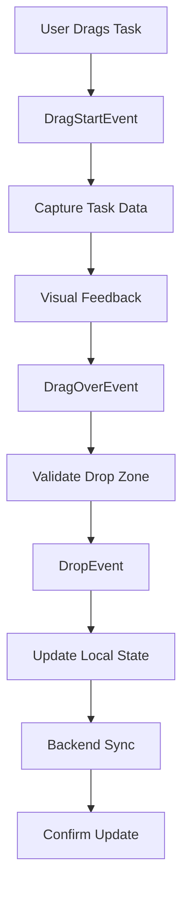

# Design Document

## Overview

This design addresses the drag-and-drop functionality bug in the Kanban task management system where tasks cannot be properly moved between status columns. The solution focuses on fixing event handling, state management, and backend synchronization to ensure reliable task movement operations.

## Steering Document Alignment

### Technical Standards (tech.md)
- Follows React best practices with functional components and hooks
- Uses TypeScript for type safety and compile-time error prevention
- Implements proper error boundaries for graceful error handling
- Adheres to single responsibility principle in component design

### Project Structure (structure.md)
- Components organized in `/src/components/kanban/` directory
- Hooks placed in `/src/hooks/` for reusable logic
- Type definitions in `/src/types/` for consistency
- Tests colocated with components in `__tests__` directories

## Code Reuse Analysis

### Existing Components to Leverage
- **@dnd-kit/core**: Current drag-and-drop library - will fix integration issues
- **KanbanBoard component**: Main board component - will enhance event handling
- **KanbanColumn component**: Column component - will fix drop zone detection
- **useKanbanTasks hook**: Task management hook - will ensure proper state updates
- **useTaskActions hook**: Task actions hook - will fix status update logic

### Integration Points
- **TaskStore**: Zustand store for task state management - ensure proper sync
- **Task type system**: Existing TypeScript types - maintain type safety
- **Error boundaries**: Existing error handling - enhance for drag operations

## Architecture

The solution maintains the current architecture while fixing the event handling chain and state synchronization issues in the drag-and-drop system.

### Modular Design Principles
- **Single File Responsibility**: Separate drag logic, drop logic, and state updates
- **Component Isolation**: Keep drag-drop concerns isolated from display logic
- **Service Layer Separation**: Separate UI events from backend operations
- **Utility Modularity**: Create focused utilities for drag-drop validation



## Components and Interfaces

### KanbanBoard Component Enhancement
- **Purpose:** Fix main drag-drop orchestration and event handling
- **Interfaces:** 
  - handleDragEnd: Process completed drag operations
  - handleDragOver: Validate drop zones during drag
  - handleDragStart: Initialize drag state
- **Dependencies:** @dnd-kit/core, useKanbanTasks, useTaskActions
- **Reuses:** Existing board layout and column rendering

### KanbanColumn Component Enhancement
- **Purpose:** Fix drop zone detection and visual feedback
- **Interfaces:**
  - useDroppable hook integration
  - isOver state for visual feedback
  - setNodeRef for proper DOM binding
- **Dependencies:** @dnd-kit/core, Task components
- **Reuses:** Existing column header and task list rendering

### DragDropHandler Utility (New)
- **Purpose:** Centralize drag-drop validation and state management
- **Interfaces:**
  - validateDrop(source, target): Validate if drop is allowed
  - processTaskMove(taskId, newStatus): Handle task movement
  - rollbackMove(taskId, originalStatus): Handle failed operations
- **Dependencies:** Task types, validation utilities
- **Reuses:** Type guards and validation functions

## Data Models

### DragDropState
```typescript
interface DragDropState {
  activeTaskId: string | null;
  activeTask: Task | null;
  originalStatus: TaskStatus | null;
  targetStatus: TaskStatus | null;
  isDragging: boolean;
}
```

### TaskMoveEvent
```typescript
interface TaskMoveEvent {
  taskId: string;
  fromStatus: TaskStatus;
  toStatus: TaskStatus;
  timestamp: number;
  success: boolean;
  error?: string;
}
```

## Error Handling

### Error Scenarios

1. **Network Failure During Update**
   - **Handling:** Rollback local state to original position
   - **User Impact:** Error toast shown, task returns to original column

2. **Invalid Drop Target**
   - **Handling:** Prevent drop operation, show visual feedback
   - **User Impact:** Task springs back to original position

3. **Concurrent Modification**
   - **Handling:** Refresh task data, retry with latest state
   - **User Impact:** Brief loading indicator, then successful move

4. **Permission Denied**
   - **Handling:** Show permission error, rollback move
   - **User Impact:** Error message explaining permission issue

## Testing Strategy

### Unit Testing
- Test drag event handlers in isolation
- Validate state management logic
- Test error handling and rollback mechanisms
- Verify type guards and validation functions

### Integration Testing
- Test full drag-drop flow with mock backend
- Verify state synchronization between components
- Test error recovery scenarios
- Validate visual feedback timing

### End-to-End Testing
- Test drag-drop across all column combinations
- Verify backend persistence of changes
- Test concurrent user scenarios
- Validate accessibility with keyboard navigation