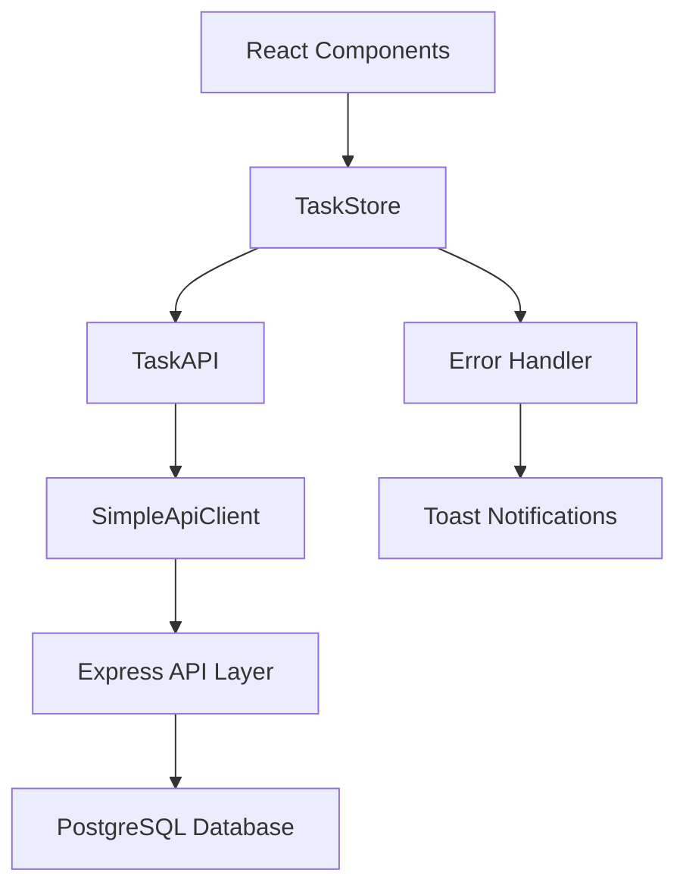

# Design Document

## Overview

This design addresses the critical mock mode issue by establishing a direct API connection between the React frontend and Express backend for task operations. The solution focuses on the minimal scope: enabling GET and PATCH operations for tasks to ensure proper persistence to the PostgreSQL database, with immediate error handling and retry mechanisms on failures.

## Steering Document Alignment

### Technical Standards (tech.md)
- Follows TypeScript strict mode for type safety
- Maintains React functional components with hooks pattern
- Uses Zustand for state management consistency
- Implements immediate error feedback with toast notifications

### Project Structure (structure.md)
- Preserves existing `src/stores/` architecture
- Maintains separation between API layer and store logic
- Follows component-based UI organization
- Uses established Docker containerization approach

## Code Reuse Analysis

### Existing Components to Leverage
- **TaskStore (src/stores/taskStore.ts)**: Core state management with existing state structure
- **TaskAPI (src/stores/api/taskApi.ts)**: Basic HTTP client structure
- **SimpleApiClient**: HTTP client for GET/PATCH requests
- **Dashboard Component**: UI logic for task display and interaction
- **KanbanBoard/TaskCard**: Drag-and-drop status update interface

### Integration Points
- **PostgreSQL Database**: Existing tasks table with proper schema
- **Express API Layer**: Docker container `ai-todo-api-layer` running on port 3003
- **UI Components**: KanbanBoard and TaskCard for status updates

## Architecture

Simple three-layer architecture with direct API communication:

### Modular Design Principles
- **Single File Responsibility**: API client handles only HTTP communication, stores manage state, components handle UI
- **Component Isolation**: Task operations isolated from UI concerns, error handling centralized
- **Service Layer Separation**: Clear boundaries between data access (API), business logic (stores), and presentation (components)
- **Utility Modularity**: Error handling and toast notifications in focused modules



## Components and Interfaces

### TaskStore (Simplified)
- **Purpose:** Central state management with direct API calls and immediate error handling
- **Interfaces:** 
  - `fetchTasks()` - GET from `/api/v1/tasks`, show error and retry button on failure
  - `updateTaskStatus(id, status)` - PATCH to `/api/v1/tasks/:id` with status only
- **Dependencies:** TaskAPI, Toast notifications
- **Reuses:** Existing Zustand store pattern, current state structure
- **Non-Scope:** addTask/deleteTask operations not included in this fix

### TaskAPI (Minimal)
- **Purpose:** Direct HTTP communication with immediate success/failure response
- **Interfaces:**
  - `fetchTasks()` - GET from `/api/v1/tasks` returns Task[] sorted by createdAt DESC
  - `updateTaskStatus(id, status)` - PATCH to `/api/v1/tasks/:id` with {status} returns Task
- **Dependencies:** SimpleApiClient
- **Reuses:** Existing HTTP client, endpoint configuration

### Error Handler
- **Purpose:** Immediate user feedback on API failures
- **Interfaces:**
  - `showError(message)` - Display toast notification with retry action
  - `rollbackState(previousState)` - Restore UI state on API failure
- **Dependencies:** Toast library
- **Reuses:** Existing error handling patterns

## Data Models

### Task Model (Core Properties)
```typescript
interface Task {
  id: string;           // UUID from database
  title: string;        // Task title
  status: 'todo' | 'in_progress' | 'done'; // Status enum
  createdAt: string;    // ISO8601 string, converted to Date on client
  updatedAt: string;    // ISO8601 string, converted to Date on client
}
```

### Task Model (Future Extensions)
```typescript
// These properties exist in database but are not focus of this fix
interface TaskExtended extends Task {
  description?: string; // Optional description
  priority?: 'low' | 'medium' | 'high' | 'urgent'; // Priority levels
  projectId?: string;   // Optional project association
  assigneeId?: string;  // Optional user assignment
  tags?: string[];      // Associated tag IDs
  dueDate?: string;     // ISO8601 string
  estimatedHours?: number; // Optional time estimate
}
```

### API Endpoints
```typescript
// GET /api/v1/tasks
// Response: Task[] (sorted by createdAt DESC - newest first)

// PATCH /api/v1/tasks/:id
// Request: { status: 'todo' | 'in_progress' | 'done' }
// Response: Task
```

### Status Update Request
```typescript
interface StatusUpdateRequest {
  status: 'todo' | 'in_progress' | 'done';
}
```

## Error Handling

### Error Scenarios
1. **API Connection Failure on Task Fetch**
   - **Handling:** Show error toast with "Retry" button, keep current empty/error state
   - **User Impact:** "Failed to load tasks - [Retry]" button

2. **Status Update Failure**
   - **Handling:** Immediate UI rollback to previous status, show error toast with retry
   - **User Impact:** Status visually reverts, "Failed to update task status - [Retry]"

3. **Network Timeout**
   - **Handling:** Cancel request after 5 seconds, rollback UI state, show retry option
   - **User Impact:** "Request timed out - [Retry]"

4. **Server Error (500)**
   - **Handling:** Show error message with retry option, maintain current UI state
   - **User Impact:** "Server error - [Retry]"

## Testing Strategy

### Unit Testing
- TaskStore state transitions for successful updates
- TaskStore rollback behavior on API failures
- API client GET and PATCH request formatting
- Date string conversion from ISO8601 to Date objects
- Task sorting by createdAt DESC

### Integration Testing
- Complete task status update workflow through API
- Error handling and UI rollback scenarios
- Task fetching from database with proper sorting
- Retry mechanism functionality

### End-to-End Testing
- User drags task between columns → status persists across page refresh
- API returns error → task status reverts to original position with error message
- User clicks retry button → API call executes again
- Tasks display in newest-first order (createdAt DESC)