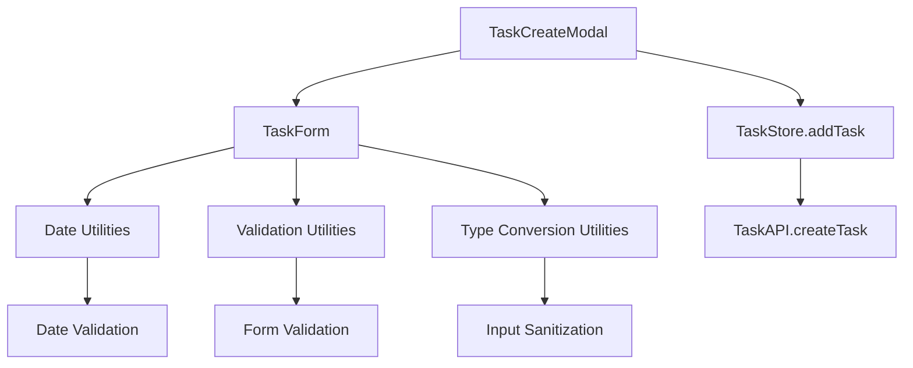

# Design Document

## Overview

本設計では、「新しいタスク」作成機能における「TypeError: dueDate.getTime is not a function」エラーを修正します。このエラーは主にフォームからの日付データ処理において、文字列として渡される日付データをDate オブジェクトとして処理しようとする際に発生しています。修正では、型安全性を保ちながら一貫した日付処理メカニズムを実装します。

## Steering Document Alignment

### Technical Standards (tech.md)
- TypeScript による型安全性の強化
- React Hooks を活用した状態管理
- エラー処理の一元化
- テスト駆動開発の採用

### Project Structure (structure.md)
- コンポーネントベースのアーキテクチャ維持
- src/components/task/ 配下でのタスク関連コンポーネント管理
- src/utils/ 配下での共通ユーティリティ配置
- 型定義の src/types/ 配下での管理

## Code Reuse Analysis

### Existing Components to Leverage
- **TaskForm.tsx**: メインのフォームコンポーネントとして継続使用、日付処理ロジックを改善
- **TaskCreateModal.tsx**: モーダル表示ロジックを維持、エラーハンドリングを強化
- **useTaskStore**: タスク作成APIの呼び出しメカニズムを継続活用
- **FormField コンポーネント**: 入力フィールドの表示とバリデーション表示に継続使用

### Integration Points
- **Task Store (Zustand)**: 既存のaddTask メソッドとの互換性を維持
- **Task API Layer**: 既存のtaskAPI.createTask との統合
- **Form Validation System**: 既存のバリデーション機構を拡張
- **Tag/Project Stores**: 既存のタグ・プロジェクト選択機能との統合

## Architecture

本修正では、日付処理に特化したユーティリティ層を追加し、型安全性を強化したデータフロー設計を採用します。コンポーネント間の責任分離を明確にし、エラー処理の一元化を実現します。

### Modular Design Principles
- **Single File Responsibility**: 日付処理専用のユーティリティファイルを分離
- **Component Isolation**: フォームコンポーネントとモーダルコンポーネントの責任明確化
- **Service Layer Separation**: バリデーション、データ変換、API通信の層分離
- **Utility Modularity**: 日付処理、バリデーション、型変換ユーティリティの分離



## Components and Interfaces

### Enhanced TaskForm Component
- **Purpose:** タスク作成・編集フォームの表示と入力処理、日付データの安全な変換
- **Interfaces:** 
  - `onSubmit(data: CreateTaskInput)`: 型安全なタスクデータの送信
  - `onCancel()`: フォームキャンセル処理
  - Enhanced validation with date-specific error handling
- **Dependencies:** Date utilities, validation utilities, task/project/tag stores
- **Reuses:** 既存のFormField、Input、Button コンポーネント

### Enhanced TaskCreateModal Component  
- **Purpose:** タスク作成モーダルの表示制御と統合エラーハンドリング
- **Interfaces:**
  - `onTaskCreate(data: CreateTaskInput)`: 日付処理を含む安全なタスク作成
  - Enhanced error display with field-specific messages
- **Dependencies:** TaskForm, Modal, enhanced error handling utilities
- **Reuses:** 既存のModal コンポーネント、エラー表示コンポーネント

### New Date Processing Utility
- **Purpose:** 日付文字列とDate オブジェクト間の安全な変換、バリデーション
- **Interfaces:**
  - `safeParseDate(dateInput: string | Date | undefined): Date | null`
  - `validateDateInput(dateInput: string): ValidationResult`
  - `formatDateForAPI(date: Date): string`
- **Dependencies:** Native Date API、バリデーションライブラリ
- **Reuses:** 新規作成（既存の日付処理パターンを参考に設計）

### Enhanced Validation Utilities
- **Purpose:** フォーム入力の包括的バリデーション、日付検証を含む
- **Interfaces:**
  - `validateTaskForm(formData: TaskFormData): ValidationErrors`
  - `validateDateRange(date: Date): ValidationResult`
- **Dependencies:** Date processing utility
- **Reuses:** 既存のvalidateForm パターンを拡張

## Data Models

### Enhanced TaskFormData
```typescript
interface TaskFormData {
  title: string;
  description: string;
  priority: Priority;
  dueDate: string; // Form input as string
  estimatedHours: string; // Form input as string  
  tags: Tag[];
  projectId?: string;
}
```

### Enhanced CreateTaskInput
```typescript
interface CreateTaskInput {
  title: string;
  description?: string;
  priority?: Priority;
  projectId?: string;
  assigneeId?: string;
  tags?: Tag[];
  dueDate?: Date; // Properly converted Date object
  estimatedHours?: number; // Properly parsed number
}
```

### New DateProcessingResult
```typescript
interface DateProcessingResult {
  isValid: boolean;
  date?: Date;
  error?: string;
  originalInput: string | Date | undefined;
}
```

### Enhanced ValidationErrors
```typescript
interface ValidationErrors {
  title?: string[];
  description?: string[];
  dueDate?: string[]; // Enhanced with date-specific errors
  estimatedHours?: string[];
  tags?: string[];
  projectId?: string[];
  general?: string[]; // For cross-field validation errors
}
```

## Error Handling

### Error Scenarios
1. **Invalid Date Format Input**
   - **Handling:** Date processing utility returns structured error with specific message
   - **User Impact:** Field-level error message showing expected date format
   - **Recovery:** User can correct the date format without losing other form data

2. **Date Conversion Failure (getTime error)**
   - **Handling:** Safe date parsing with null checks before calling Date methods
   - **User Impact:** Clear error message indicating date processing failure
   - **Recovery:** Form maintains input state, user can retry with corrected input

3. **Future/Past Date Validation**
   - **Handling:** Date range validation with configurable rules
   - **User Impact:** Contextual message about acceptable date range
   - **Recovery:** Date picker constraints and validation feedback

4. **Project/Tag Association Errors**
   - **Handling:** Validation of selected project/tag existence before submission
   - **User Impact:** Specific error messages for missing or invalid associations
   - **Recovery:** Dropdown refreshes and user can reselect valid options

5. **API Communication Failures**
   - **Handling:** Network error handling with retry mechanism
   - **User Impact:** User-friendly network error messages with retry option
   - **Recovery:** Form data preserved, offline mode available for later sync

## Testing Strategy

### Unit Testing
- **Date Processing Utilities**: Test all date conversion edge cases including invalid inputs
- **Form Validation**: Test all validation scenarios including date-specific validations
- **TaskForm Component**: Test form state management and data transformation
- **Error Handling**: Test error propagation and user feedback mechanisms

### Integration Testing
- **Form to Store Integration**: Test complete task creation flow with various input combinations
- **Modal Integration**: Test modal opening, form submission, and closing behaviors
- **API Integration**: Test task creation with mocked API responses including error scenarios

### End-to-End Testing
- **Complete Task Creation Flow**: Test user journey from modal opening to successful task creation
- **Error Recovery Scenarios**: Test user experience during various error conditions
- **Cross-browser Date Handling**: Ensure consistent behavior across different browsers
- **Accessibility Testing**: Ensure screen readers can navigate error states effectively