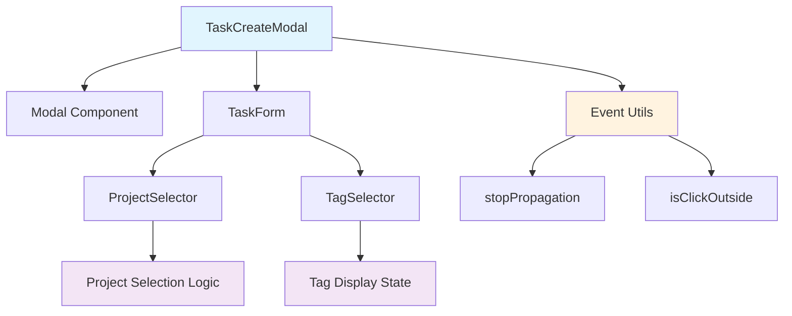

# Design Document

## Overview

This document details the technical design for fixing two critical UI bugs in the task creation workflow:
1. Modal closure when selecting projects during task creation
2. Duplicate tag display causing visual confusion

The fixes will maintain existing architecture patterns while addressing event propagation issues and UI state management inconsistencies.

## Steering Document Alignment

### Technical Standards (tech.md)
The design follows established React + TypeScript patterns with:
- Component isolation and single responsibility
- Event handler optimization and controlled propagation
- State management using Zustand stores
- Consistent error handling and validation

### Project Structure (structure.md)
Implementation follows existing project organization:
- UI components in `src/components/ui/`
- Task-related components in `src/components/task/`
- Utilities in `src/utils/`
- Event handling patterns consistent with existing modal components

## Code Reuse Analysis

### Existing Components to Leverage
- **Modal Component (src/components/ui/modal.tsx)**: Will extend click outside detection logic
- **ProjectSelector (src/components/project/ProjectSelector.tsx)**: Will modify event propagation
- **TaskForm Component (src/components/task/TaskForm.tsx)**: Will refactor tag display logic
- **TagSelector (src/components/tag/TagSelector.tsx)**: Will consolidate display behavior

### Integration Points
- **TaskCreateModal**: Main integration point for modal event handling fixes
- **FormField Components**: Integration with validation and error display
- **Event System**: Proper event propagation control throughout the component tree

## Architecture

The solution implements controlled event propagation and unified state management:

### Modular Design Principles
- **Single File Responsibility**: Separate modal behavior, form state, and UI component logic
- **Component Isolation**: ProjectSelector and TagSelector operate independently with clear interfaces
- **Service Layer Separation**: Event handling utilities separate from UI components
- **Utility Modularity**: Event propagation helpers as reusable utilities



## Components and Interfaces

### Component 1: Enhanced Modal Component
- **Purpose:** Add precise click-outside detection that excludes form elements
- **Interfaces:** 
  - `onOpenChange: (open: boolean) => void`
  - `excludeSelectors?: string[]` (new prop)
- **Dependencies:** Event utilities, DOM traversal helpers
- **Reuses:** Existing modal styling and accessibility features

### Component 2: ProjectSelector Event Fix
- **Purpose:** Prevent event bubbling during project selection
- **Interfaces:**
  - `onProjectSelect: (project: Project | null) => void`
  - `stopPropagation?: boolean` (optional optimization)
- **Dependencies:** React event system, existing project store
- **Reuses:** Current project selection logic and UI components

### Component 3: Unified TagSelector Display
- **Purpose:** Consolidate tag display to single location with clear state
- **Interfaces:**
  - `displayMode: 'inline' | 'separate' | 'auto'` (new prop)
  - `selectedTags: Tag[]`
  - `onTagsChange: (tags: Tag[]) => void`
- **Dependencies:** Tag store, existing tag UI components
- **Reuses:** Current tag creation and management logic

### Component 4: Event Utilities
- **Purpose:** Provide reusable event handling utilities
- **Interfaces:**
  - `createStopPropagationHandler(handler: Function): EventHandler`
  - `isClickOutsideExcluding(event: Event, excludeSelectors: string[]): boolean`
- **Dependencies:** DOM API
- **Reuses:** None (new utility module)

## Data Models

### Enhanced Event Handler Config
```typescript
interface EventHandlerConfig {
  stopPropagation: boolean
  preventDefault: boolean
  excludeSelectors: string[]
}
```

### Tag Display Configuration
```typescript
interface TagDisplayConfig {
  mode: 'inline' | 'separate' | 'auto'
  maxVisibleTags?: number
  showCount?: boolean
}
```

## Error Handling

### Error Scenarios
1. **Event Propagation Failure:** Event handlers not properly stopping propagation
   - **Handling:** Fallback to default behavior with console warning
   - **User Impact:** Minor UI glitch but functionality preserved

2. **DOM Selection Failure:** Click outside detection fails to find elements
   - **Handling:** Graceful degradation to basic click detection
   - **User Impact:** Slightly less precise modal behavior

3. **Tag State Desync:** Tag display states become inconsistent
   - **Handling:** Force re-render with clean state
   - **User Impact:** Brief flicker but correct final display

## Testing Strategy

### Unit Testing
- Event propagation utilities with mock DOM events
- Tag display logic with various state combinations
- Project selector event handling with synthetic events

### Integration Testing
- Modal behavior with nested interactive elements
- Form submission flow with all field types
- Tag selection and display across different interaction patterns

### End-to-End Testing
- Complete task creation workflow through modal
- Project selection without modal closure
- Tag addition and removal with consistent display
- Error recovery scenarios and edge cases