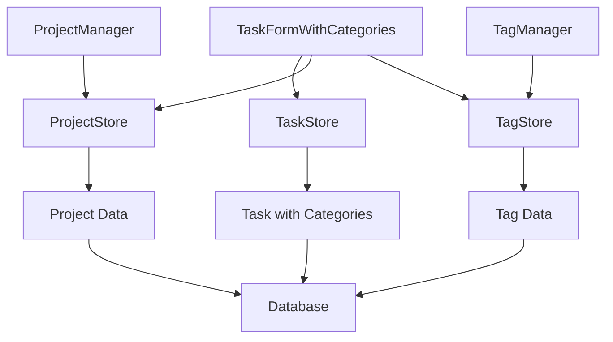

# Design Document

## Overview

プロジェクト・タグ・タスクの完全な連携機能を実装し、ユーザーがプロジェクトとタグを作成・編集して全てのタスク画面で利用できるようにします。既存のZustand storeアーキテクチャを活用し、React + TypeScriptの現在の実装パターンに従います。

## Steering Document Alignment

### Technical Standards (tech.md)
- Zustand storeパターンを使用した状態管理
- TypeScriptによる型安全性の確保
- React Hook Form + Zod バリデーションパターンの適用
- エラーハンドリングとユーザーフィードバックの統一

### Project Structure (structure.md)
- `src/components/[domain]/` 構造に従ったコンポーネント配置
- `src/stores/` でのドメイン別store管理
- `src/types/` での型定義の集約
- `src/utils/` での共通ユーティリティの配置

## Code Reuse Analysis

### Existing Components to Leverage
- **ProjectSelector**: タスク作成・編集時のプロジェクト選択に再利用
- **TagSelector**: タスク作成・編集時のタグ選択に再利用  
- **TaskCreateModal/TaskEditModal**: プロジェクト・タグ選択機能を統合
- **ProjectCreateModal**: 既存のプロジェクト作成モーダルを拡張
- **TagCreateModal/TagEditModal**: 既存のタグ管理モーダルを拡張

### Integration Points
- **Store統合**: `projectStore`, `tagStore`, `taskStore`間のデータ同期
- **Database Schema**: 既存のTask型に `projectId` (nullable) と `tagIds` (string[]) を活用
- **API Endpoints**: 既存のCRUD APIパターンを踏襲したプロジェクト・タグAPI
- **UI Components**: 既存のModal、Form、Dropdownコンポーネントの再利用

## Architecture

既存のZustandベースの状態管理アーキテクチャを拡張し、プロジェクト・タグ・タスク間のデータ整合性を保ちます。各ドメインのstoreは独立性を保ちつつ、必要に応じて他のstoreの情報を参照します。

### Modular Design Principles
- **Single File Responsibility**: プロジェクト管理、タグ管理、タスク連携をそれぞれ独立したモジュールで実装
- **Component Isolation**: ProjectManager、TagManager、TaskFormWithCategoriesの独立コンポーネント
- **Service Layer Separation**: データアクセス（stores）、ビジネスロジック（hooks）、プレゼンテーション（components）の分離
- **Utility Modularity**: プロジェクト・タグのvalidation、formattingユーティリティ（filteringは将来課題）



## Components and Interfaces

### ProjectManager Component
- **Purpose:** プロジェクトの一覧表示、作成、編集機能を提供
- **Interfaces:** 
  - `onProjectCreate(project: CreateProjectInput): void`
  - `onProjectEdit(id: string, project: UpdateProjectInput): void`
  - `onProjectDelete(id: string): void`
- **Dependencies:** ProjectStore, ProjectCreateModal, ProjectEditModal
- **Reuses:** 既存のProjectCard、ProjectBadge、ProjectCreateModalコンポーネント

### TagManager Component
- **Purpose:** タグの一覧表示、作成、編集機能を提供
- **Interfaces:**
  - `onTagCreate(tag: CreateTagInput): void`
  - `onTagEdit(id: string, tag: UpdateTagInput): void`
  - `onTagDelete(id: string): void`
- **Dependencies:** TagStore, TagCreateModal, TagEditModal
- **Reuses:** 既存のTagBadge、TagCreateModal、TagEditModal、ColorPickerコンポーネント

### TaskFormWithCategories Component
- **Purpose:** タスク作成・編集時のプロジェクト・タグ選択機能を提供
- **Interfaces:**
  - `selectedProject?: Project`
  - `selectedTags: Tag[]`
  - `onProjectChange(project: Project | null): void`
  - `onTagsChange(tags: Tag[]): void`
- **Dependencies:** ProjectStore, TagStore, ProjectSelector, TagSelector
- **Reuses:** 既存のTaskForm、ProjectSelector、TagSelectorコンポーネント
 - **UI Note:** タグはチェックボックスまたはマルチセレクトコンポーネントで複数選択可能

### TaskListWithCategories Component
- **Purpose:** タスク一覧でのプロジェクト・タグ表示機能を提供
- **Interfaces:**
  - `tasks: TaskWithCategories[]`
- **Dependencies:** TaskStore, ProjectStore, TagStore
- **Reuses:** 既存のTaskCard、ProjectBadge、TagBadgeコンポーネント
 - **Scope Note:** 検索/フィルタ機能は本スコープ外（将来課題）

## Data Models

### Minimum Persisted Shapes
```typescript
interface Task { id: string; title: string; projectId?: string | null; tagIds: string[] }
interface Project { id: string; name: string }
interface Tag { id: string; name: string }
```

### TaskWithCategories (Existing Task型の拡張活用)
```typescript
interface TaskWithCategories extends Task {
  project?: Project;     // プロジェクト情報（populated）
  tags: Tag[];          // タグ情報の配列（populated）
}
```

### ProjectWithTaskCount (既存Project型の拡張)
```typescript
interface ProjectWithTaskCount extends Project {
  taskCount: number;    // 関連タスク数
  completedTaskCount: number;  // 完了済みタスク数
}
```

### TagWithTaskCount (既存Tag型の拡張)
```typescript
interface TagWithTaskCount extends Tag {
  taskCount: number;    // 関連タスク数
}
```

## Error Handling

### Error Scenarios
1. **プロジェクト作成失敗**
   - **Handling:** ProjectStoreでエラーをキャッチし、エラーメッセージを設定
   - **User Impact:** トースト通知でエラー内容を表示、フォームは開いたまま

2. **タグ作成失敗**
   - **Handling:** TagStoreでエラーをキャッチし、エラーメッセージを設定
   - **User Impact:** インライン エラー表示、再入力を促すUI状態

3. **タスク保存時の関連データエラー**
   - **Handling:** TaskStoreでプロジェクト・タグの存在確認、不整合時は警告
   - **User Impact:** 保存前確認ダイアログで不整合を通知、修正を促す

<!-- 削除時の依存関係エラーは本スコープ外のため将来課題へ移設 -->

## Testing Strategy

### Unit Testing
- ProjectStore、TagStore、TaskStoreのCRUD操作テスト
- ProjectManager、TagManager、TaskFormWithCategoriesコンポーネントテスト
- プロジェクト・タグの validation関数テスト

### Integration Testing
- プロジェクト作成 → タスクでの選択 → 一覧表示の連携フローテスト
- タグ作成 → タスクでの選択 → 一覧表示の連携フローテスト

### End-to-End Testing (Playwright MCP)

#### Preconditions
- アプリケーションはポート`5173`で起動しPlaywright MCPから到達可能
- テスト開始前にDBを既知のクリーン状態へリセット（migration + seed 等）

#### Scenarios
- 完全な連携フロー（要件1-7）のPlaywright MCPテスト
- ポート5173での自動テスト実行
- プロジェクト作成 → タグ作成 → タスク作成 → 編集 → 表示確認の全工程

## Out of Scope / Future Work
- 検索/フィルタ機能（UI/ユーティリティ/プロップ設計）
- 削除操作における依存関係確認や関連データ処理の詳細設計・テスト
