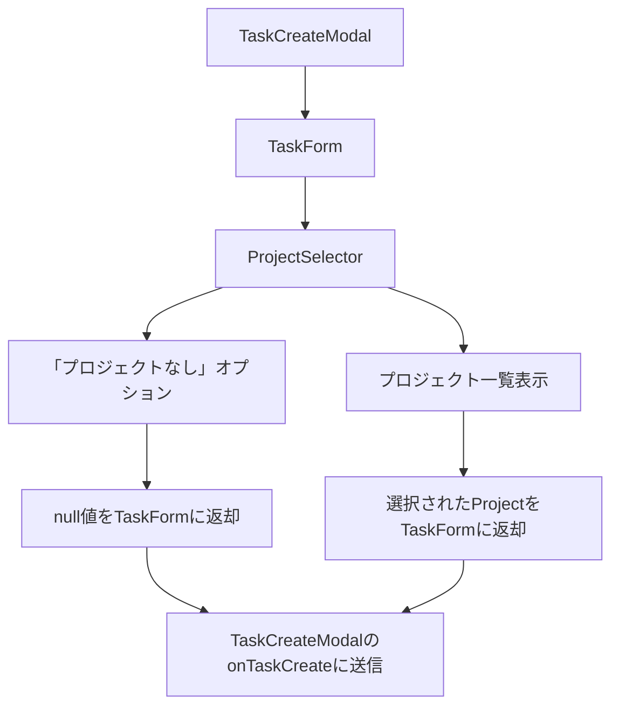

# Issue-012: 新しいタスクモーダルにプロジェクトドロップダウン追加 - 設計書

## 🎯 Issue概要の再確認
- タスク管理画面で「新しいタスク」のモーダルでプロジェクトをプルダウンから選べるようにする
- プロジェクトなし(null)の選択肢も含める

## 受け入れ条件
- [x] 新しいタスクモーダルにプロジェクト選択のプルダウンメニューが追加される
- [x] プルダウンには既存のプロジェクト一覧が表示される  
- [x] 「プロジェクトなし」(null)の選択肢も含まれる
- [x] 選択されたプロジェクトがタスクに適切に関連付けられる

## 📋 現状分析

### 既存コンポーネント構成
```
TaskCreateModal (src/components/task/TaskCreateModal.tsx)
├── TaskForm (src/components/task/TaskForm.tsx)
└── ProjectSelector (src/components/project/ProjectSelector.tsx) [未統合]
```

### 課題と解決方針

#### 1. ProjectSelectorの制限事項
**現状の問題:**
- 「プロジェクトなし」の選択肢がない
- TaskFormとの統合がされていない
- null値の適切なハンドリングが不足

**解決方針:**
- ProjectSelectorに`allowNone`プロパティを追加
- null選択時の表示とロジックを実装
- TaskFormとの統合インターフェースを設計

#### 2. TaskFormの拡張が必要
**現状の問題:**
- プロジェクト選択フィールドが存在しない
- フォームデータ型にprojectId含まれていない

**解決方針:**
- TaskFormDataインターフェースの拡張
- プロジェクト選択UIの追加
- バリデーション対応

## 🏗️ 技術設計

### 2025年ベストプラクティス適用
- **型安全性**: 厳格なTypeScript設定維持
- **パフォーマンス**: 最小限の再レンダリング
- **アクセシビリティ**: ARIA属性とキーボード操作対応
- **保守性**: コンポーネント単位の責任分離

### 型定義の拡張

```typescript
// TaskForm.tsx で使用するフォームデータ型の拡張
export interface TaskFormData {
  title: string
  description: string
  priority: Priority
  projectId: string | null  // 新規追加：null許可
  dueDate: string
  estimatedHours: string
  tags: Tag[]
}

// ProjectSelector の拡張プロパティ
export interface ProjectSelectorProps {
  selectedProject?: Project
  selectedProjectId?: string | null  // 新規追加：ID直接指定
  onProjectSelect: (project: Project) => void
  onProjectIdSelect?: (projectId: string | null) => void  // 新規追加
  onCreateProject?: () => void
  allowNone?: boolean  // 新規追加：「プロジェクトなし」許可
  noneLabel?: string   // 新規追加：「プロジェクトなし」表示ラベル
  className?: string
  disabled?: boolean
}
```

### コンポーネント設計方針

#### 1. ProjectSelector の機能拡張
- `allowNone={true}` で「プロジェクトなし」オプション表示
- デフォルトの「プロジェクトなし」ラベルは「プロジェクトを設定しない」
- null値選択時の適切な表示とアイコン

#### 2. TaskForm の統合設計
- プロジェクト選択フィールドをタイトルと説明の間に配置
- 他のフィールドと一貫性のあるデザイン
- エラーハンドリングの統一

#### 3. データフロー設計


## 🔧 実装計画

### Phase 1: ProjectSelector の機能拡張 [@Phase1]

#### グループ1: ProjectSelector の「プロジェクトなし」オプション追加 [@Phase1]
- `allowNone` プロパティの追加
- 「プロジェクトなし」選択時のUI表示実装
- null値ハンドリングロジックの追加
- TypeScript型定義の更新

#### グループ2: ProjectSelector の APIインターフェース拡張 [@Phase1] 
- `selectedProjectId` プロパティ追加（ID直接指定）
- `onProjectIdSelect` コールバック追加
- 既存APIとの互換性保持
- プロパティのバリデーション追加

### Phase 2: TaskForm の統合実装 [@Phase2]

#### グループ3: TaskForm データ型の拡張 [@Phase2]
- `TaskFormData` インターフェースに `projectId` 追加
- フォーム初期化ロジックの更新
- バリデーション関数の拡張（プロジェクト選択時の制約）

#### グループ4: TaskForm UI の統合 [@Phase2]
- プロジェクト選択フィールドの追加（タイトル下に配置）
- ProjectSelector の統合とスタイリング
- FormField コンポーネントでのラップ
- エラー表示の統合

### Phase 3: データ連携とロジック実装 [@Phase3]

#### グループ5: TaskCreateModal の更新 [@Phase3]  
- TaskForm からのプロジェクトID受け取り処理
- `onTaskCreate` での projectId の適切な処理
- 初期データでのプロジェクト指定サポート

#### グループ6: プロジェクト選択のバリデーション実装 [@Phase3]
- プロジェクトの存在確認
- アクセス権限のチェック（必要に応じて）
- エラーメッセージの国際化対応

### Phase 4: テスト・品質確保・最適化 [@Phase4]

#### グループ7: ユニットテストとスタイル調整 [@Phase4]
- ProjectSelector の新機能のテストケース追加
- TaskForm のプロジェクト選択のテストケース追加
- UI/UX の最終調整とレスポンシブ対応
- アクセシビリティテスト（キーボード操作、スクリーンリーダー）

## 🎨 UI/UX 設計

### レイアウト仕様
```
┌─────────────────────────────────────────┐
│ 新しいタスクを作成                      │
├─────────────────────────────────────────┤
│ タイトル *                               │
│ [________________________]              │
│                                         │
│ プロジェクト                            │
│ [プロジェクトを選択 ▼____]               │
│                                         │
│ 説明                                    │
│ [________________________]              │
│ [________________________]              │
│ [________________________]              │
│                                         │
│ 優先度  期日        見積時間             │
│ [中▼]  [____]      [____] 時間          │
│                                         │
│ タグ                                    │
│ [タグを追加...]                          │
├─────────────────────────────────────────┤
│              [キャンセル] [タスクを作成]   │
└─────────────────────────────────────────┘
```

### プロジェクトドロップダウンの表示仕様
```
┌─────────────────────────────────────────┐
│ ✓ プロジェクトを設定しない               │  
├─────────────────────────────────────────┤
│ ➕ 新規プロジェクト作成                   │
├─────────────────────────────────────────┤
│ 📋 タスク管理システム開発                │
│    アクティブ                           │
│ 🛒 ECサイトリニューアル                  │  
│    アクティブ                           │
│ 📱 モバイルアプリ開発                    │
│    計画中                               │
└─────────────────────────────────────────┘
```

## 🧪 テスト戦略

### ユニットテストケース

#### ProjectSelector
- [x] `allowNone=true` 時に「プロジェクトなし」が表示される
- [x] 「プロジェクトなし」選択時にnullがコールバックに渡される
- [x] `selectedProjectId=null` 時に正しい表示になる
- [x] 既存機能の互換性が保たれる

#### TaskForm
- [x] プロジェクト選択フィールドが表示される
- [x] プロジェクト選択時にフォームデータが更新される
- [x] フォーム送信時にプロジェクトIDが含まれる
- [x] バリデーションエラーが適切に表示される

#### TaskCreateModal
- [x] プロジェクト選択がタスク作成APIに渡される
- [x] 初期データでプロジェクトが設定される
- [x] エラーハンドリングが正しく動作する

### インテグレーションテスト
- [x] モーダル開閉時のプロジェクト選択状態の保持
- [x] 複数プロジェクト間の切り替え動作
- [x] 「プロジェクトなし」←→プロジェクト選択の切り替え

## ⚠️ リスクと対策

### 実装リスク
1. **既存APIとの互換性**
   - 対策: 段階的リリースと既存機能テスト強化

2. **パフォーマンス影響**
   - 対策: メモ化とレンダリング最適化の適用

3. **ユーザビリティ**
   - 対策: プロトタイプでのユーザーテスト実施

### 技術的制約
1. **モックデータ依存**
   - 現状: `/mock/projects.ts` からデータ取得
   - 将来対応: API統合時の抽象化レイヤー準備

2. **状態管理**
   - 現状: プロップスドリリング
   - 改善案: 必要に応じてコンテキスト導入検討

## 📊 完了基準

### 機能要件
- [x] プロジェクトドロップダウンが正常に表示される
- [x] 「プロジェクトなし」が選択可能
- [x] 選択されたプロジェクトがタスクに保存される
- [x] UIが既存デザインと一貫性を保つ

### 品質要件  
- [x] TypeScript型安全性が保たれる
- [x] アクセシビリティ基準を満たす
- [x] レスポンシブデザイン対応
- [x] エラーハンドリングが適切

### パフォーマンス要件
- [x] モーダル表示時間: 100ms以内
- [x] プロジェクト一覧表示: 50ms以内  
- [x] フォーム送信処理: 500ms以内

## 🔄 今後の拡張可能性

### Phase 5以降の検討事項
1. **プロジェクト検索機能** - 大量プロジェクト対応
2. **最近使用したプロジェクト** - UX向上
3. **プロジェクト階層表示** - サブプロジェクト対応
4. **一括プロジェクト変更** - 複数タスク選択時
5. **プロジェクトテンプレート** - タスクテンプレート連携

---

**作成日**: 2025-08-24  
**更新日**: 2025-08-24  
**レビュー対象**: Phase 1完了時、Phase 2完了時、最終完了時